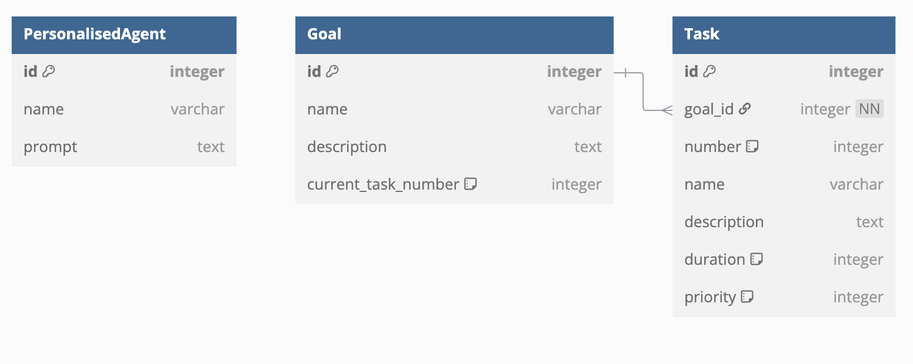
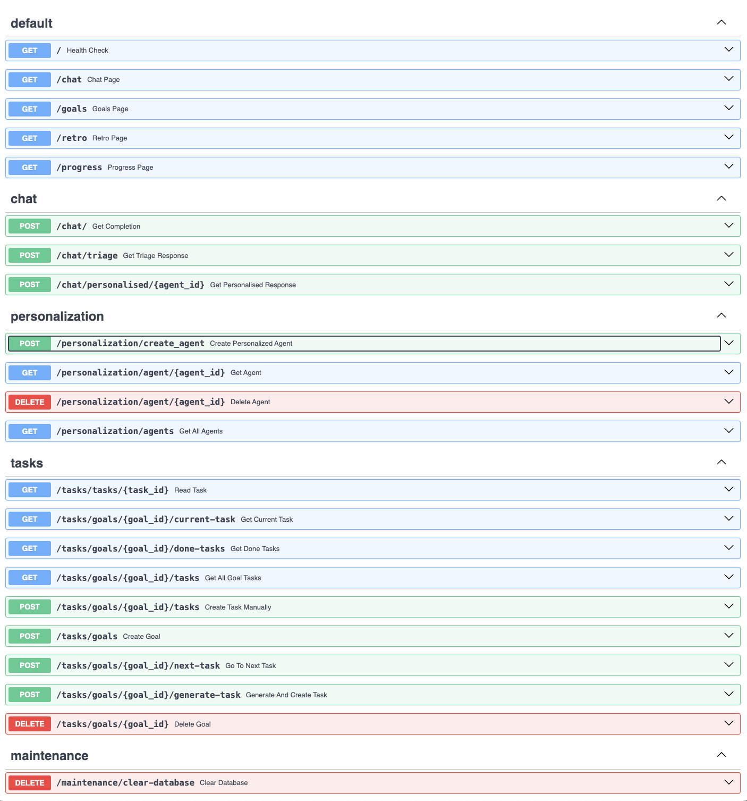

# Oh My Coach

Agentic AI coach that helps you crush your goals — and go beyond!

---

## Table of Contents

* [Oh My Coach](#oh-my-coach)
    * [Table of Contents](#table-of-contents)
    * [Description](#description)
    * [Technologies](#technologies)
    * [Images](#images)
    * [Project Overview](#project-overview)
        * [Inspiration](#inspiration)
        * [What it does?](#what-it-does)
        * [How we built it](#how-we-built-it)
        * [Challenges We Ran Into](#challenges-we-ran-into)
        * [What We Learned](#what-we-learned)
        * [What's next for Oh My Coach](#whats-next-for-oh-my-coach)
    * [Setup](#setup)
        * [Environment Setup](#environment-setup)
        * [Install UV Package Manager](#install-uv-package-manager)
        * [Create and Activate Virtual Environment](#create-and-activate-virtual-environment)
        * [Create Database](#create-database)
    * [How to run](#how-to-run)
        * [Run backend](#run-backend)
    * [Development Resources \& Acknowledgments](#development-resources--acknowledgments)

---

## Description

The application offers a personal agent who acts as both a supportive friend and a dedicated coach. It gets to know you over time, helps you stay motivated, assists in organizing your daily plans, and supports you in achieving your goals. At the end of the day, it also provides a space to clear your mind and reflect before sleep.

## Technologies

## Images

## Project Overview

### Inspiration

Some people live busy lives and often find themselves at the end of the day with a cluttered mind. The idea behind **Oh-My-Coach** was to provide an app where you could reflect on the events of the day, talk about your goals, worries, and anything you might usually share only with a close friend. When needed, the app enables a retrospective chat that helps you organize your thoughts and find peace of mind.

### What it does?

**Oh-My-Coach** is an AI agent that gradually gets to know you through regular conversations.

When prompted, it consults with a specialist in a relevant field (e.g., dietitian, psychologist, personal trainer), providing them with the full context.

These specialists can see your goals and track your progress. They generate a tailored response and propose a task, which you can choose to accept and add to your personal task list.

The app includes a **Goals and Tasks** view, where you can track your current goals and review the tasks suggested to help you reach them.

Need to clear your head? The **Retro** view allows you to talk to your agent using speech-to-speech, letting you unload your deepest thoughts in a safe space.

### How we built it

* **Python** for backend and **???** for frontend.

### Challenges We Ran Into

**User Simplicity**: Balancing a clean, user-friendly interface with the depth of features we wanted to include was a significant design challenge.

**Custom Prompting**: Crafting precise and effective prompts was essential for guiding the AI to produce meaningful and context-aware responses.

### What We Learned

**New Technologies**: We gained hands-on experience with OpenAI’s Responses API and the new Agent SDK, which were central to building our app’s intelligence.

**Collaboration**: Strong teamwork and clear communication helped us overcome technical and creative challenges throughout the project.

### What's next for Oh My Coach

**Google Calendar Integration**: Automatically sync your tasks with Google Calendar to keep your schedule organized and stay on track.

**Learning Dashboard**: A dedicated space where users can explore curated learning materials tailored to their goals and interests.

## Setup

### Environment Setup

Create a `.env` file in the root directory of the project.
This file will store your configuration and API keys.
See `.env.example` for an example.

> **Note:** Never commit your `.env` file to version control. The `.gitignore` file already includes it.

### Install UV Package Manager

Install the UV package manager by running the following command:

```bash
pip install uv
```

### Create and Activate Virtual Environment

Synchronize dependencies and activate the virtual environment:

```bash
uv sync
source .venv/bin/activate
```

### Create Database

Run the following commands to create a database and user:

```bash
psql postgres -c "CREATE USER hackathon WITH PASSWORD 'hackathon';" && \
psql postgres -c "CREATE DATABASE hackathon OWNER hackathon;"
```

**Database Structure**


## How to run

### Run backend

```bash
fastapi dev backend/main.py
```
You can see endpoints going to adress `http://localhost:8000/docs` in your favorite browser:)

**We have a lot of endpoints;)**


---

## Development Resources & Acknowledgments

* [Database diagrams](https://dbdiagram.io/)
* [Full-Stack FastAPI Template](https://github.com/fastapi/full-stack-fastapi-template)
* [Hackathon-Starter](https://github.com/Kabanosk/hackathon-starter/) - this repo is heavily inspired by this :)
* [Hackathon-Booster](https://github.com/igorjakus/hackathon-booster/)
* [OpenAI-Realtime-FastAPI](https://github.com/Geo-Joy/openai-realtime-fastapi)
