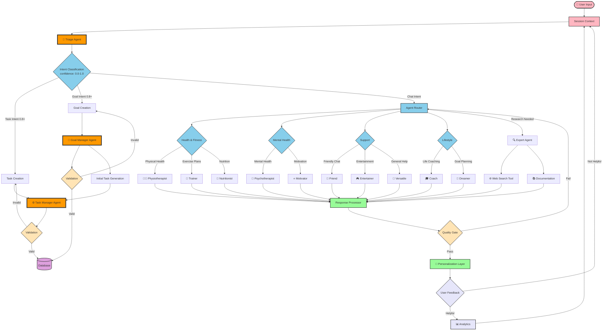

# Agent Pipeline

## Overview Flow

```mermaid
graph TD
    %% Main Flow Elements
    User([👤 User Input]) --> Session[Session Context]
    Session --> Triage[🎯 Triage Agent]
    
    %% Intent Classification with confidence scores
    Triage --> IntentCheck{Intent Classification<br/>confidence: 0.0-1.0}
    IntentCheck -->|Task Intent 0.8+| TaskCreation[Task Creation]
    IntentCheck -->|Goal Intent 0.8+| GoalCreation[Goal Creation]
    IntentCheck -->|Chat Intent| AgentSelection[Agent Router]
    
    %% Task Creation Flow
    TaskCreation --> TaskManager[⚙️ Task Manager Agent]
    TaskManager --> TaskValidation{Validation}
    TaskValidation -->|Valid| DB[(Database)]
    TaskValidation -->|Invalid| TaskCreation
    
    %% Goal Creation Flow
    GoalCreation --> GoalManager[🎯 Goal Manager Agent]
    GoalManager --> GoalValidation{Validation}
    GoalValidation -->|Valid| DB
    GoalValidation -->|Invalid| GoalCreation
    GoalManager --> InitialTask[Initial Task Generation]
    InitialTask --> TaskManager
    
    %% Agent Selection Flow with Categories
    AgentSelection --> HealthAgents{Health & Fitness}
    AgentSelection --> MentalAgents{Mental Health}
    AgentSelection --> SupportAgents{Support}
    AgentSelection --> LifestyleAgents{Lifestyle}
    
    %% Health & Fitness Category
    HealthAgents --> |Physical Health| Physiotherapist[👨‍⚕️ Physiotherapist]
    HealthAgents --> |Exercise Plans| Trainer[💪 Trainer]
    HealthAgents --> |Nutrition| Nutritionist[🥗 Nutritionist]
    
    %% Mental Health Category
    MentalAgents --> |Mental Health| Psychotherapist[🧠 Psychotherapist]
    MentalAgents --> |Motivation| Motivator[⭐ Motivator]
    
    %% Support Category
    SupportAgents --> |Friendly Chat| Friend[👋 Friend]
    SupportAgents --> |Entertainment| Entertainer[🎮 Entertainer]
    SupportAgents --> |General Help| Versatile[🔧 Versatile]
    
    %% Lifestyle Category
    LifestyleAgents --> |Life Coaching| Coach[🎓 Coach]
    LifestyleAgents --> |Goal Planning| Dreamer[💭 Dreamer]
    
    %% Special Case - Expert with Tools
    AgentSelection --> |Research Needed| Expert[🔍 Expert Agent]
    Expert --> WebSearch[🌐 Web Search Tool]
    Expert --> Documentation[📚 Documentation]
    
    %% Response Processing - Fixed syntax
    Physiotherapist & Psychotherapist & Motivator & Trainer & Friend & Coach & Dreamer & Nutritionist & Entertainer & Versatile & Documentation & WebSearch --> ResponseProcessor[Response Processor]
    
    %% Quality Checks
    ResponseProcessor --> QualityCheck{Quality Gate}
    QualityCheck -->|Pass| Personalization[🎨 Personalization Layer]
    QualityCheck -->|Fail| AgentSelection
    
    %% Final Response Flow
    Personalization --> FeedbackCheck{User Feedback}
    FeedbackCheck -->|Helpful| Analytics[📊 Analytics]
    FeedbackCheck -->|Not Helpful| Session
    
    %% Session Memory Update
    Analytics --> Session
    
    %% Styling
    classDef primary fill:#ff9900,stroke:#333,stroke-width:4px;
    classDef secondary fill:#87CEEB,stroke:#333,stroke-width:2px;
    classDef process fill:#98FB98,stroke:#333,stroke-width:2px;
    classDef storage fill:#DDA0DD,stroke:#333,stroke-width:2px;
    classDef input fill:#FFB6C1,stroke:#333,stroke-width:2px;
    classDef validation fill:#FFE4B5,stroke:#333,stroke-width:2px;
    classDef feedback fill:#E6E6FA,stroke:#333,stroke-width:2px;
    
    class Triage,TaskManager,GoalManager primary;
    class IntentCheck,AgentSelection,HealthAgents,MentalAgents,SupportAgents,LifestyleAgents secondary;
    class ResponseProcessor,Personalization process;
    class DB storage;
    class User,Session input;
    class TaskValidation,GoalValidation,QualityCheck validation;
    class FeedbackCheck,Analytics feedback;
```

## Agent Types Hierarchy

```mermaid
graph TB
    %% Base Structure
    BaseAgent[🤖 Base Agent<br/>Context Aware] --> Health
    BaseAgent --> Mental
    BaseAgent --> Lifestyle
    BaseAgent --> Support
    BaseAgent --> Special

    %% Health Category with Capabilities
    Health[🏥 Health Agents<br/>Medical Knowledge] --> Physiotherapist[👨‍⚕️ Physiotherapist<br/>Exercise Safety]
    Health --> Trainer[💪 Trainer<br/>Workout Plans]
    Health --> Nutritionist[🥗 Nutritionist<br/>Diet Planning]

    %% Mental Health Category
    Mental[🧠 Mental Health<br/>Psychology] --> Psychotherapist[🎯 Psychotherapist<br/>Mental Support]
    Mental --> Motivator[⭐ Motivator<br/>Encouragement]

    %% Lifestyle Category
    Lifestyle[🌟 Lifestyle<br/>Life Planning] --> Coach[🎓 Coach<br/>General Advice]
    Lifestyle --> Dreamer[💭 Dreamer<br/>Goal Setting]

    %% Support Category
    Support[🤝 Support<br/>General Help] --> Friend[👋 Friend<br/>Conversation]
    Support --> Entertainer[🎮 Entertainer<br/>Fun Activities]
    Support --> Versatile[🔧 Versatile<br/>Fallback Agent]

    %% Special Category with Tools
    Special[⚡ Special Agents<br/>Enhanced Access] --> Expert[🔍 Expert<br/>Web Search]
    Special --> TaskManager[⚙️ Task Manager<br/>Task Creation]
    Special --> GoalManager[🎯 Goal Manager<br/>Goal Setting]

    %% Tools and Integrations
    Expert -..->|Uses| WebTools[🌐 Web Tools]
    TaskManager -..->|Uses| Database[(💾 Database)]
    GoalManager -..->|Uses| Database

    %% Styling
    classDef category fill:#ffeb99,stroke:#333,stroke-width:2px;
    classDef agent fill:#87CEEB,stroke:#333,stroke-width:2px;
    classDef tool fill:#98FB98,stroke:#333,stroke-width:2px;
    classDef storage fill:#DDA0DD,stroke:#333,stroke-width:2px;
    
    class BaseAgent,Health,Mental,Lifestyle,Support,Special category;
    class Physiotherapist,Trainer,Nutritionist,Psychotherapist,Motivator,Coach,Dreamer,Friend,Entertainer,Versatile,Expert,TaskManager,GoalManager agent;
    class WebTools tool;
    class Database storage;
```
